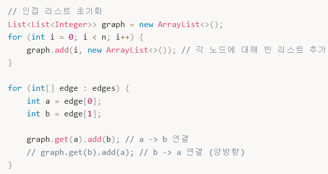
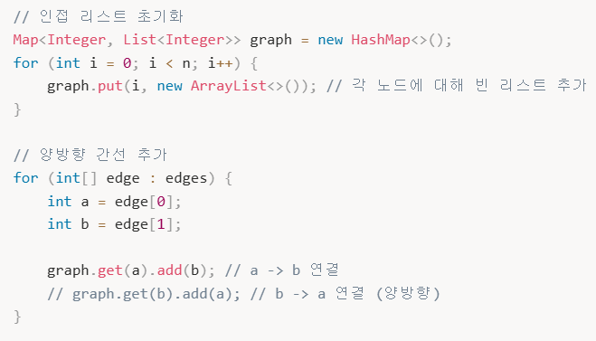

# 🔍 BFS (Breadth-First Search, 너비 우선 탐색)
- 루트 노드(혹은 특정 노드)에서 시작해서 **인접한 노드를 먼저 차례대로 탐색**하는 알고리즘.
- **특징**: 가중치가 없는 그래프에서 **최단 경로**를 보장합니다.
- **자료구조**: 선입선출(FIFO) 방식의 **Queue(큐)**를 사용하여 구현합니다.
- **시간 복잡도**: $O(V + E)$ (V: 정점 수, E: 간선 수)

# 🔍 DFS (Depth-First Search, 깊이 우선 탐색)
- 그래프나 트리에서 **하나의 분기를 완전히 탐색**한 후 다음 분기로 넘어가는 알고리즘.
- **특징**: 그래프의 사이클을 찾아야 할 때, 경로의 특징이나 제약 조건을 기억해야 할 때 고려.
- **자료구조**: 주로 **재귀 함수**나 **Stack**을 사용하여 구현합니다.
- **시간 복잡도**: $O(V + E)$ (V: 정점 수, E: 간선 수)

⚠️ 실전 Tip: 간선리스트로 주어지면 인접리스트로 변환해서 풀이하는 것이 편리함.

만약 정점이 숫자가 아니거나 0부터 시작이 아니라면 HashMap으로 인접 리스트를 구현할 수 있다.
